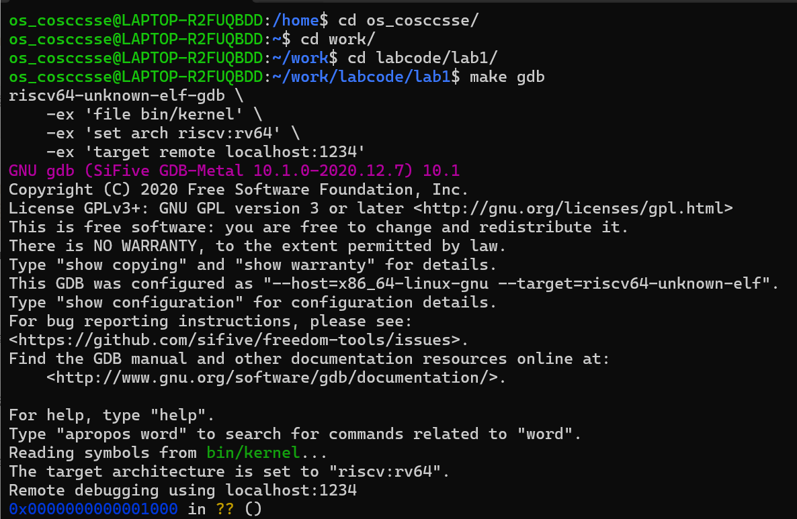

# 操作系统lab1实验报告
<center><p><font face="黑体" size=7><b>操作系统lab1实验报告</b></font></p></center>
<center><p><font face="楷体" size=4>姓名：宋卓伦，赵雨萱，何立烽&nbsp;&nbsp;&nbsp;&nbsp;学号：2311095，2311100，2311101</font></p></center>
<center><p><font face="楷体" size=4>南开大学计算机学院、密码与网络空间安全学院</font></p></center>
<!-- <br> -->

## 实验名称：最小可执行内核

## 实验要求：

实验1主要讲解==最小可执行内核==和==启动流程==。

我们的内核主要在`Qemu`模拟器上运行，它可以模拟一台 64 位`RISC-V`计算机。

为了让我们的内核能够正确对接到`Qemu`模拟器上，需要了解`Qemu` 模拟器的启动流程，还需要一些程序内存布局和编译流程（特别是链接）相关知识。

本章我们将进行并完成：

- 使用==链接脚本==描述内存布局
- 进行==交叉编译==生成可执行文件，进而生成内核镜像
- 使用`OpenSBI`作为`bootloader`加载内核镜像，并使用`Qemu`进行模拟
- 使用`OpenSBI`提供的服务，在屏幕上格式化打印字符串用于以后调试

## 实验内容

### 环境安装

你可以搜索下面的网站下载[Ubuntu发行版](https://cn.ubuntu.com/download/desktop)，或者自己的应用市场也可以轻松找到，甚至在终端输入`wsl`即可自动安装。

安装子系统成功之后，由于我们要防止程序之间相互影响，这里我们选择单独创建一个新用户，将实验代码与我们正常使用的代码区（多为你自己的用户区域）分开：

```shell
sudo adduser your_name	# 设置好密码，其余默认即可
```

> 我们未来的实验都在这里完成

然后进入配置文件，为新创建的用户赋予对应的权限从而能够正常打开：

```shell
vim /etc/sudoers	# 进入管理用户权限的文件

# 在文件里面按下“o”，然后输入以下内容
your_name ALL=(ALL)		ALL			# 添加权限
your_name ALL=(ALL:ALL)		ALL		# 下面这种方式会有更多权限
# 按下esc，输入：wq!，完成保存并退出
```

大致没有什么问题了。注意我们还需要为新创建的用户文件夹赋予相应权限，否则是无法打开的。

### 第一步实验

我们的内核主要在`Qemu`模拟器上运行，它可以模拟一台64位`RISC-V`计算机。

为了让我们的内核能够正确对接到`Qemu`模拟器上，需要了解`Qemu`模拟器的启动流程，还需要一些程序内存布局和编译流程（特别是链接）相关知识，以及通过`OpenSBI`固件来通过服务。

我们进行编译：

```shell
make debug	# 这是qemu虚拟机提供的一种调试模式；
make qemu	# 这是qemu下正常的编译模式，启动之后
make gdb	# 这是启动gdb调试的一种方式，在这里我们可以进行单步/多步/退回调试等等
```



在进入之后，我们可以查看一下相关的情况：


我们查看更加详细的内容如下：

```cmd
(gdb) x/10i $pc
=> 0x1000:      auipc   t0,0x0
   0x1004:      addi    a1,t0,32
   0x1008:      csrr    a0,mhartid
   0x100c:      ld      t0,24(t0)
   0x1010:      jr      t0
   0x1014:      unimp
   0x1016:      unimp
   0x1018:      unimp
   0x101a:      0x8000
   0x101c:      unimp
(gdb) x/10x $pc
0x1000: 0x00000297      0x02028593      0xf1402573      0x0182b283
0x1010: 0x00028067      0x00000000      0x80000000      0x00000000
0x1020: 0xedfe0dd0      0x260d0000
```

可以看到，当前执行的代码位于刚刚起步的位置，然后看看各个寄存器的情况：

```cmd
(gdb) i r
ra             0x0      0x0
sp             0x0      0x0
gp             0x0      0x0
tp             0x0      0x0
t0             0x0      0
t1             0x0      0
t2             0x0      0
fp             0x0      0x0
s1             0x0      0
a0             0x0      0
a1             0x0      0
a2             0x0      0
a3             0x0      0
a4             0x0      0
a5             0x0      0
a6             0x0      0
a7             0x0      0
s2             0x0      0
s3             0x0      0
s4             0x0      0
s5             0x0      0
s6             0x0      0
s7             0x0      0
s8             0x0      0
s9             0x0      0
s10            0x0      0
s11            0x0      0
t3             0x0      0
t4             0x0      0
t5             0x0      0
t6             0x0      0 
pc             0x1000   0x1000
```

### 第二步实验

我们首先进行单步调试。调试的核心在于打断点。首先我们进行打点：

```cmd
(gdb) watch *0x80200000
Hardware watchpoint 1: *0x80200000
(gdb) b* kern_entry
Breakpoint 1 at 0x80200000: file kern/init/entry.S, line 7.
```

显然，`0x80200000`对应的就是`kern_entry`函数入口位置。看看附近的代码：

```assembly
#include <mmu.h>
#include <memlayout.h>

    .section .text,"ax",%progbits
    .globl kern_entry
kern_entry:
    la sp, bootstacktop

    tail kern_init

.section .data
    # .align 2^12
    .align PGSHIFT
    .global bootstack
bootstack:
    .space KSTACKSIZE 
    .global bootstacktop
bootstacktop:
```

继续运行发现，代码在我们预先设计的断点暂停了。按照上面的方式查看情况：


此时`kern_entry`已经执行完毕了。

>  在下面的图片中，使用`tmux`可以实现终端的分屏：
>
> 但是我们发现`VScode`的终端也未尝不利，加上`tmux`不能自由地进行`copy&paste`，只有添加一些配置才行，遂放弃了`tmux`的使用

查看一下此时寄存器各个值的情况：


```shell
(gdb) i r                                  
ra             0x80000a02       0x80000a02
sp             0x8001bd80       0x8001bd80
gp             0x0      0x0
tp             0x8001be00       0x8001be00
t0             0x80200000       2149580800
t1             0x1      1
t2             0x1      1
fp             0x8001bd90       0x8001bd90
s1             0x8001be00       2147597824
a0             0x0      0
a1             0x82200000       2183135232
a2             0x80200000       2149580800
a3             0x1      1
a4             0x800    2048
a5             0x1      1
a6             0x82200000       2183135232
a7             0x80200000       2149580800
s2             0x800095c0       2147521984
s3             0x0      0
s4             0x0      0
s5             0x0      0
s6             0x0      0
s7             0x8      8
s8             0x2000   8192
s9             0x0      0
s10            0x0      0
s11            0x0      0
t3             0x0      0
t4             0x0      0
t5             0x0      0
t6             0x82200000       2183135232
pc             0x80200000       0x80200000 <kern_entry>
```

不难发现PC的值已经变成了当前的地址。我们查看该点后续10条指令的内容：

```cmd
(gdb) x/10i $pc
=> 0x80200000 <kern_entry>:     auipc   sp,0x3
   0x80200004 <kern_entry+4>:   mv      sp,sp
   0x80200008 <kern_entry+8>:   j       0x8020000a <kern_init>
   0x8020000a <kern_init>:      auipc   a0,0x3
   0x8020000e <kern_init+4>:    addi    a0,a0,-2
   0x80200012 <kern_init+8>:    auipc   a2,0x3
   0x80200016 <kern_init+12>:   addi    a2,a2,-10
   0x8020001a <kern_init+16>:   addi    sp,sp,-16
   0x8020001c <kern_init+18>:   li      a1,0
   0x8020001e <kern_init+20>:   sub     a2,a2,a0
(gdb) x/10i $sp
   0x8001bd80:  fsd     fs0,56(a2)
   0x8001bd82:  c.srli64        s0
   0x8001bd84:  unimp
   0x8001bd86:  unimp
   0x8001bd88:  fsd     fs0,56(a2)
   0x8001bd8a:  c.srli64        s0
   0x8001bd8c:  unimp
   0x8001bd8e:  unimp
   0x8001bd90:  li      t1,16
   0x8001bd92:  lw      s1,12(a2)
(gdb) x/10x $pc
0x80200000 <kern_entry>:        0x00003117      0x00010113      0x3517a009      0x05130000
0x80200010 <kern_init+6>:       0x3617ffe5      0x06130000      0x1141ff66      0x8e094581
0x80200020 <kern_init+22>:      0x00efe406      0x05974940
(gdb) x/10x $sp
0x8001bd80:     0x8001be00      0x00000000      0x8001be00      0x00000000
0x8001bd90:     0x46444341      0x55534d49      0x00000000      0x00000000
0x8001bda0:     0x00000000      0x00000000
```

这个时候，我们打印一下当前的函数调用栈

```shell
(gdb) bt
#0  kern_entry () at kern/init/entry.S:7
```

做完上述实验之后，我们可以回答下面的问题了：

### 练习1

#### 问题：理解内核启动中的程序入口操作

阅读`kern/init/entry.S`内容代码，结合操作系统内核启动流程，说明指令`la sp, bootstacktop`完成了什么操作，目的是什么？`tail kern_init`完成了什么操作，目的是什么？

#### 答案

`la sp, bootstacktop`把`bootstacktop`的地址加载到寄存器`sp`中

内核刚启动时，没有任何运行环境，**必须要手动建立一块可用的栈空间让后续的函数调用**，局部变量分配分配能够正常使用栈空间，为进入`kern_init`提供所需环境`tail kern_init:`跳转到`kern_init`

`kern_init`是操作系统内核用C语言编写的初始化主函数，这是为了将控制权从汇编启动阶段转交给C语言内容初始化阶段，完成从低级引导到高级内容的过渡

kern_init 函数肩负着内核初启的核心任务：

初始化内核环境：例如，清理 .bss 段，为未初始化的全局变量赋零值。

向用户提供可视化反馈：这是操作系统与开发者/用户的第一次交互，通过输出信息告诉我们：“os is loading ...”。

### 练习2

#### 问题：使用GDB验证启动流程

为了熟悉使用`QEMU`和`GDB`的调试方法，请使用`GDB`跟踪`QEMU`模拟的`RISC-V`从加电开始，直到执行内核第一条指令（跳转到`0x80200000`）的整个过程。

通过调试，请思考并回答：`RISC-V`硬件加电后最初执行的几条指令位于什么地址？它们主要完成了哪些功能？

请在报告中简要记录你的调试过程、观察结果和问题的答案。

**tips:**

启动流程可以分为以下几个阶段：

1) `CPU`从复位地址（`0x1000`）开始执行初始化固件（`OpenSBI`）的汇编代码，进行最基础的硬件初始化。
2) `SBI`固件进行主初始化，其核心任务之一是将内核加载到 `0x80200000`。可以使用`watch *0x80200000`观察内核加载瞬间，避免单步跟踪大量代码。
3) `SBI`最后跳转到`0x80200000`，将控制权移交内核。使用`b *0x80200000` 可在此中断，验证内核开始执行

#### 答案

我们不难发现，在执行`make debug`之后，下面的文件都被编译了，然后得到镜像文件：

```cmd
$ make debug
+ cc kern/init/entry.S
+ cc kern/init/init.c
+ cc kern/libs/stdio.c
+ cc kern/driver/console.c
+ cc libs/printfmt.c
+ cc libs/readline.c
+ cc libs/sbi.c
+ cc libs/string.c
+ ld bin/kernel
riscv64-unknown-elf-objcopy bin/kernel --strip-all -O binary bin/ucore.img
```

执行之后，我们按照上面的方式单步调试，不难发现RISC-V在上电之后，PC的复位地址在`0x1000`，从此处开始执行，先顺序执行，然后寄存器`$t0`被赋值为`0x80000000`再跳转；之后执行`OpenSBI`的指令，加载镜像文件，将内核文件加载到内存之中，最后跳转到`0x80200000`

```cmd
(gdb) x/10i $pc
=> 0x1000:      auipc   t0,0x0
   0x1004:      addi    a1,t0,32
   0x1008:      csrr    a0,mhartid
   0x100c:      ld      t0,24(t0)
   0x1010:      jr      t0
   0x1014:      unimp
   0x1016:      unimp
   0x1018:      unimp
   0x101a:      0x8000
   0x101c:      unimp
```

```cmd
我们先来解读一下这几条指令：
auipc   t0,0x0： 
让当前pc加上立即数0存在寄存器t0中，t0暂时保存了基地址
addi    a1,t0,32：
用t0＋32得到一个地址存入a1
csrr    a0,mhartid： 
把当前CPU的hardid读到a0，固件用这个值可以知道自己为第几个hart
ld      t0,24(t0)： 
从t0＋24的位置加载值到t0，通常是存放跳转目标地址
jr      t0：
从PC跳到to（上一步的地址），即OpenSBI固件的入口去执行

因此，这几条指令主要是为了把一些运行参数准备好（如hartid），从ROM读出固件的入口地址，然后跳转到OpenSBI
```

全部的操作流程如下：

基于这个输出，我们可以重构完整的启动过程：

##### 阶段 1: 硬件复位

显然，CPU从`0x1000`开始执行；然后执行最基础的硬件初始化；进而跳转到`OpenSBI`(`0x80000000`)

##### 阶段 2: `OpenSBI`初始化

在`0x80000000`开始执行，开始进行平台硬件初始化；设置内存保护（PMP）并准备运行时的环境；最后加载内核到 `0x80200000`

##### 阶段 3: 内核启动

第一步是让`OpenSBI`跳转到 `0x80200000`并执行`entry.S`代码；设置内核栈来调用`kern_init()`函数；最后输出`(THU.CST) os is loading ...，`，进入代码的“死循环”

#### 关键地址总结

|     地址     |               用途               |
| :----------: | :------------------------------: |
|   `0x1000`   |      复位向量，硬件启动地址      |
| `0x80000000` |      `OpenSBI`固件加载地址       |
| `0x80200000` | 实验中给定的操作系统内核加载地址 |

基于实际的 GDB 调试和分析，RISC-V 系统的启动流程比传统描述更为复杂和分层：

##### 1. 复位向量与硬件初始化阶段

**实际复位地址**：`0x1000`（而非通常认为的 `0x80000000`）  
- 复位地址，指的是CPU在上电的时候，或者按下复位键的时候，PC被赋的初始值，RISCV标准相对灵活，芯片实现者可自主选择复位地址，因此不同芯片有差异。
```assembly
# 0x1000 处的实际指令序列（来自调试观察）
0x1000: auipc   t0, 0x0          # 计算当前PC相对地址
0x1004: addi    a1, t0, 32       # 准备参数地址
0x1008: csrr    a0, mhartid      # 读取当前硬件线程ID
0x100c: ld      t0, 24(t0)       # 加载跳转目标地址
0x1010: jr      t0               # 跳转到 OpenSBI
```

**此阶段功能**：获取当前`CPU`核心标识（`hartid`）并准备基础执行环境参数；最后跳转到固件主入口点（`0x80000000`）

##### 2. 固件初始化阶段（`OpenSBI`）

**执行地址**：`0x80000000`（硬件和软件的选择），然后得到**实际观察到的输出**：

```
OpenSBI v0.4 (Jul  2 2019 11:53:53)
Platform Name: QEMU Virt Machine
Firmware Base: 0x80000000
Firmware Size: 112 KB
```

**固件核心任务**：
- **硬件抽象层初始化**：建立机器模式（M-mode）运行环境
- **物理内存保护配置**：
  
  ```c
  PMP0: 0x80000000-0x8001ffff (A)      // 保护OpenSBI自身
  PMP1: 0x00000000-0xffffffff (A,R,W,X) // 允许内核访问所有内存
  ```
- **设备初始化**：时钟、中断控制器、串口等基础外设
- **内核加载**：将操作系统内核映像加载到 `0x80200000`

##### 3. 内核启动阶段

**内核入口地址**：`0x80200000`（由链接脚本 `tools/kernel.ld` 确定）

**实际调试观察到的指令序列**：
```assembly
0x80200000 <kern_entry>: auipc sp, 0x3    # 设置内核栈指针
0x80200004 <kern_entry+4>: mv sp, sp      # 冗余操作（编译器生成）
0x80200008 <kern_entry+8>: j kern_init    # 跳转到C语言入口
0x8020000a <kern_init>: ...               # 开始执行内核初始化
```

**内核初始化任务**：设置内核栈空间；清零 BSS 段（未初始化数据区）；初始化控制台和设备驱动；建立内存管理系统并配置异常和中断处理。

##### 4. 完整的执行流验证

通过 GDB 调试验证的实际执行路径：

```
加电复位 
    ↓
0x1000 (复位向量) → 基础CPU初始化
    ↓
0x80000000 (OpenSBI) → 硬件抽象层初始化
    ↓  
0x80200000 (内核入口) → 操作系统环境建立
    ↓
kern_init() → 内核主初始化
    ↓
"(THU.CST) os is loading ..." → 内核运行
```

##### 5. 关键地址空间布局

|     地址     |     内容      |           功能           |
| :----------: | :-----------: | :----------------------: |
|   `0x1000`   |   复位代码    |     最基础硬件初始化     |
| `0x80000000` | `OpenSBI`固件 | 硬件抽象层，`M-mode`运行 |
| `0x80200000` | 操作系统内核  | `S-mode`运行，内核入口点 |
| `0x80203000` |   内核栈顶    |   由 `kern_entry` 设置   |

##### 6. 启动流程的总结

这种分层启动架构体现了 RISC-V 的设计哲学：

1. **安全性**：通过 PMP 实现内存保护，固件与内核隔离
2. **可移植性**：`OpenSBI`提供统一的硬件抽象接口
3. **灵活性**：不同硬件平台只需实现各自的底层初始化
4. **可调试性**：清晰的执行边界便于问题定位

`RISC-V`启动流程是一个精心设计的层次化过程：

- **硬件层**（`0x1000`）：完成最基础的 CPU 状态初始化
- **固件层**（`OpenSBI`）：建立安全的硬件抽象环境  
- **内核层**（`0x80200000`）：构建完整的操作系统服务

这种设计确保了系统的可靠性、安全性和可维护性，也为操作系统开发提供了清晰的硬件接口。

### challenge1：加载内核之OS是怎么存储的

bootloader存储在一个不需要驱动程序，CPU就可以直接读取的地方，即一块像Memory一样，可以直接使用load/store命令可以访问，又不会担心数据会丢失的区域。  
在现代计算机中，有一些设备具备这样的特性，如早期的ROM芯片，以及后期相对普及的NOR Flash芯片，这些芯片与CPU连接之前，首先会进行初始化，在其中预置好对CPU的初始程序，即bootloader，然后再焊接至电路板上。  
在CPU启动时，会首先运行这些代码，用这些代码实现对硬盘、内存和其他复杂设备的读取。每个操作系统都应该有这一部分，完成双击前运行的准备。

### challenge2：一些小问题

为什么程序的链接地址和加载地址要统一？

因为在编译和链接的时候确定，`Store`指令中的地址不会再发生变化，因此程序的加载地址不能改变，或者需要调整`addressA`。

### challenge3：中断相关

## 实验中涉及的重要知识点

| 实验概念 | 对应的 OS 原理知识点 | 含义与理解 | 二者关系与区别 |
|-----------|----------------------|-------------|----------------|
| **OpenSBI** | 启动加载与特权级管理（Bootloader 与 M/S 模式） | OpenSBI 是 RISC-V 平台的固件，相当于传统计算机的 BIOS/UEFI。它运行在 **M 模式**，负责初始化硬件并加载操作系统内核。 | 在 OS 原理中，Bootloader 是“加载内核”的程序。OpenSBI 是一种标准化实现，它桥接了硬件与操作系统，使 OS 可以在 S 模式下运行。区别在于：OpenSBI 属于**机器态固件层**，而 OS 是**监督态软件层**。 |
| **ELF 文件** | 程序装载与链接 | 一种比较复杂的可执行文件格式，包含一个文件头(ELF header), 包含冗余的调试信息，指定程序每个section的内存布局，需要解析program header才能知道各段的信息。如果我们已经有一个完整的操作系统来解析elf文件，那么elf文件可以直接执行。但是对于OpenSBI来说，elf格式还是太复杂了。 | 在现代 OS 中，内核和用户程序通常都是 ELF 格式，加载器负责解析其中的段信息。区别在于 ELF 文件偏向**结构化与可调试性**，而 BIN 文件偏向**简洁与直接映射性**。 |
| **BIN 文件** | 内存映射与物理地址布局 | 由 ELF 文件通过 `objcopy` 转换而来，去除了多余的调试与段信息，只保留纯机器码和数据，能直接映射到指定物理地址。OPENSBI可以使用该文件 | |
| **特权级（M/S/U 模式）** | 操作系统与硬件交互的分层结构 | RISC-V 规定了四种特权级（M、Reserved、S、U），U-mode是用户程序、应用程序的特权级，S-mode是操作系统内核的特权级，M-mode是固件的特权级。 | OS 原理中讲“用户态/内核态”，RISC-V 的 M/S/U 是更精细化的实现。OpenSBI 在 M 模式，OS 在 S 模式，用户程序在 U 模式。 |
| **SBI 调用（ecall 指令）** | 系统调用与异常处理机制 | ecall 指令是 RISC-V 中用于实现受控的权限提升的关键指令。当在 U 模式（用户态）执行 ecall，会触发异常，从而陷入到 S 模式（内核态）。这是系统调用的底层机制。当在 S 模式（内核态）执行 ecall，会触发异常，从而陷入到 M 模式（机器态）。这正是我们调用 OpenSBI 服务的方式。 | 与 OS 原理中“系统调用”类似，但方向相反：系统调用是用户态 → 内核态；SBI 调用是内核态 → 机器态。 |
| **cprintf 与 SBI 封装** | I/O 抽象层与系统调用机制 | 内核中的 `cprintf()` 最终会通过多层封装调用到 `ecall → OpenSBI → QEMU 输出`。 | 从 OS 原理角度看，这是“分层抽象”思想的实践——从硬件接口到系统调用，再到标准库函数，层层封装。 |

---


## 心得体会

在这次实验中，我们完成了lab1：最小可执行内核，窥探到了操作系统的独到之处。通过上电这个简单的操作，逐渐对ucore这个简单的操作系统有了些许的体会。

在调试过程中，学会了使用GDB的断点，单步执行，查看内存等命令，清楚地观察到PC的变化与指令的执行。此外，从设置栈帧la sp, bootstacktop到跳转内核主函数tail kern_init也理解了汇编与C语言之间的衔接。

这次实验让我们意识到了操作系统并不是简单的“加载代码”，而是软件与硬件的协同过程，通过理解内核启动中的程序入口操作与GDB验证启动流程，使我对操作系统有了初步的认识。

后面，我们会继续完成接下来的实验，不断学习操作系统。
