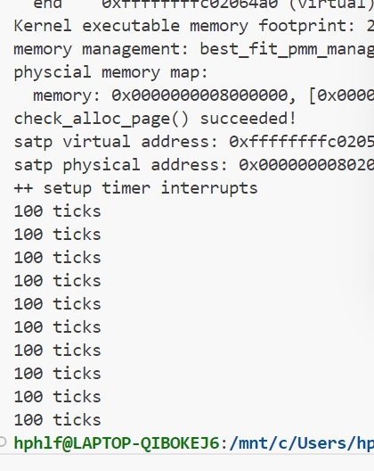

# 操作系统lab3实验报告
<center><p><font face="黑体" size=7><b>操作系统lab3实验报告</b></font></p></center>
<center><p><font face="楷体" size=4>姓名：宋卓伦，赵雨萱，何立烽&nbsp;&nbsp;&nbsp;&nbsp;学号：2311095，2311100，2311101</font></p></center>
<center><p><font face="楷体" size=4>南开大学计算机学院、密码与网络空间安全学院</font></p></center>
<!-- <br> -->  

## 实验名称：中断与中断处理
对实验报告的要求：  
基于markdown格式来完成，以文本方式为主  
填写各个基本练习中要求完成的报告内容  
列出你认为本实验中重要的知识点，以及与对应的OS原理中的知识点，并简要说明你对二者的含义，关系，差异等方面的理解（也可能出现实验中的知识点没有对应的原理知识点）  
列出你认为OS原理中很重要，但在实验中没有对应上的知识点  

### 练习1：完善中断处理 （需要编程）
请编程完善trap.c中的中断处理函数trap，在对时钟中断进行处理的部分填写kern/trap/trap.c函数中处理时钟中断的部分，使操作系统每遇到100次时钟中断后，调用print_ticks子程序，向屏幕上打印一行文字”100 ticks”，在打印完10行后调用sbi.h中的shut_down()函数关机。

要求完成问题1提出的相关函数实现，提交改进后的源代码包（可以编译执行），并在实验报告中简要说明实现过程和定时器中断中断处理的流程。实现要求的部分代码后，运行整个系统，大约每1秒会输出一次”100 ticks”，输出10行。  

---

####  1. 实现过程


具体的实现步骤如下：

a.  **包含头文件**：
    在 `kern/trap/trap.c` 文件的顶部，添加 `#include <sbi.h>`。这是为了后续能够调用 OpenSBI 提供的 `sbi_shutdown()` 关机函数。

b.  **定位处理函数**：
    在 `trap.c` 中找到 `interrupt_handler(struct trapframe *tf)` 函数，该函数负责分发所有 S 模式的中断（Interrupts）。

c.  **补充 `case IRQ_S_TIMER` 逻辑**：
    在 `interrupt_handler` 函数的 `switch (cause)` 语句中，我们找到了 `case IRQ_S_TIMER:`，并补充了以下处理逻辑：

    ```c
        case IRQ_S_TIMER:
            // "All bits besides SSIP and USIP in the sip register are
            // read-only." -- privileged spec1.9.1, 4.1.4, p59
            // In fact, Call sbi_set_timer will clear STIP, or you can clear it
            // directly.
            // cprintf("Supervisor timer interrupt\n");
             /* LAB3 EXERCISE1   YOUR CODE : 2311101 */
            /*(1)设置下次时钟中断- clock_set_next_event()
             *(2)计数器（ticks）加一
             *(3)当计数器加到100的时候，我们会输出一个`100ticks`表示我们触发了100次时钟中断，同时打印次数（num）加一
            * (4)判断打印次数，当打印次数为10时，调用<sbi.h>中的关机函数关机
            */
            clock_set_next_event();
            if (++ticks % TICK_NUM == 0) {
                print_ticks();
                static int print_count = 0;
                print_count++;
                if (print_count == 10) {
                    sbi_shutdown(); // 关机
                }
            }
            break;
    ```

#### 代码逻辑详解：

* `clock_set_next_event()`：RISC-V 的时钟中断是“一次性”的，每次触发后必须由软件重新设置下一次触发的时间。`clock_set_next_event()` 函数会调用 `sbi_set_timer`，将下一次中断时间设置为“当前时间 + `timebase`”。如果缺少这一行，时钟中断将只会触发一次。
* `if (++ticks % TICK_NUM == 0)`：`ticks` 是定义在 `clock.c` 中的全局计数器，`TICK_NUM` 宏定义为 100。此行代码实现了“每 100 次时钟中断”执行一次后续操作。
* `static int print_count = 0;`：我们使用一个**静态（static）**局部变量来累计 `print_ticks()` 的调用次数,确保了 `print_count` 只被初始化一次，并且它的值能在多次 `interrupt_handler` 调用之间保持不变，从而实现正确的计数。
* `if (print_count == 10) { sbi_shutdown(); }`：当 `print_count` 达到 10，证明 "100 ticks" 已打印 10 行，此时调用 `sbi_shutdown()` 结束内核运行，完成测试。

#### 2. 定时器中断中断处理的流程

一次完整的 S 模式定时器中断（`IRQ_S_TIMER`）的处理流程如下：

1.  **[硬件] 中断触发**：
    CPU 内部的 `time` 寄存器值达到了 M 模式固件（OpenSBI）之前通过 `sbi_set_timer` 设定的阈值。

2.  **[硬件] 自动陷入 (Trap)**：
    CPU 立即暂停当前执行的指令，并自动完成一系列操作：
    * 将当前程序计数器 `pc` 保存到 `sepc` 寄存器。
    * 将中断原因 `IRQ_S_TIMER` (值为 5) 写入 `scause` 寄存器（最高位置 1，表示是中断）。
    * 自动关闭 S 模式中断（清除 `sstatus` 寄存器的 `SIE` 位），防止中断嵌套。
    * 将 `pc` 设置为 `stvec` 寄存器中保存的地址，即 `__alltraps` 的入口地址。

3.  **[软件] 保存上下文 (SAVE_ALL)**：
    * 执行 `trapentry.S` 中的 `__alltraps` 汇编代码。
    * 在内核栈上开辟一块 `trapframe` 大小的空间。
    * 将全部 32 个通用寄存器（`x0-x31`）以及 `sstatus`, `sepc`, `scause` 等 CSR 寄存器的值保存到栈上的 `trapframe` 结构体中。

4.  **[软件] C 函数分发 (trap_dispatch)**：
    * 汇编代码将指向 `trapframe` 的指针（即当前 `sp`）存入 `a0` 寄存器，然后 `jal trap` 调用 C 函数 `trap(struct trapframe *tf)`。
    * `trap_dispatch(tf)` 函数检查 `tf->cause` 的最高位，发现是中断（负数），于是调用 `interrupt_handler(tf)`。

5.  **[软件] 中断处理**：
    * `interrupt_handler` 函数根据 `tf->cause` 的具体值（去掉最高位后为 5），进入 `case IRQ_S_TIMER:` 分支。
    * 执行我们编写的 C 代码：设置下一次时钟中断、递增 `ticks`、判断是否满 100 次、打印、判断是否满 10 次、关机。

6.  **[软件] 恢复上下文 (RESTORE_ALL)**：
    * C 函数返回到 `trapentry.S` 中的 `__trapret` 标签处。
    * `RESTORE_ALL` 宏执行，从栈上的 `trapframe` 中将所有寄存器的值加载回对应的 CPU 寄存器（`x1-x31`, `sstatus`, `sepc`）。
    * 恢复 `sp` 栈指针。

7.  **[硬件] 中断返回 (sret)**：
    * 执行 `sret` 特权指令。
    * CPU 自动将 `sepc` 寄存器的值恢复到 `pc`。
    * CPU 自动将 `sstatus.SPIE` 的值恢复到 `sstatus.SIE`（即重新使能中断）。
    * CPU 从 `pc` 指向的地址（即被中断的指令）继续执行。

#### 3. 结果验证

按照上述步骤修改 `trap.c` 文件后，在 `lab3` 目录下执行 `make qemu`。
观察 QEMU 的输出，可以看到内核启动后，大约每隔 1 秒打印一行 "100 ticks"。
在 "100 ticks" 累计打印 10 行之后，QEMU 模拟器自动关闭，终端返回命令提示符。
实验现象与要求完全一致，证明时钟中断处理实现正确。

  <div align="center">
      
  </div>

---
### 扩展练习 Challenge1：描述与理解中断流程
回答：描述ucore中处理中断异常的流程（从异常的产生开始），其中mov a0，sp的目的是什么？SAVE_ALL中寄存器保存在栈中的位置是什么确定的？对于任何中断，__alltraps 中都需要保存所有寄存器吗？请说明理由。  
 

#### ucore中处理中断异常的流程（从异常产生开始）  
1. **异常触发**：当CPU执行指令时发生中断（如时钟中断）或异常（如页错误、非法指令），硬件自动完成以下操作：
   - 保存当前程序计数器（PC）到`sepc`寄存器（记录异常发生位置）。
   - 设置`scause`寄存器（标识异常类型）。
   - 若为地址相关异常（如页错误），保存错误地址到`sbadaddr`。
   - 切换特权级（如从用户态到内核态），并跳转到预设的异常向量入口（`__alltraps`）。

2. **保存现场（`SAVE_ALL`宏）**：
   - 调整栈指针`sp`，为保存寄存器预留空间。
   - 保存所有通用寄存器（`x0-x31`）到栈中，其中`x2`（`sp`）通过`sscratch`间接保存（因`sp`本身被修改）。
   - 保存异常相关寄存器（`sstatus`、`sepc`、`sbadaddr`、`scause`）到栈中。

3. **异常处理函数调用**：
   - 通过`move a0, sp`将栈指针作为参数传递给` trap`函数（栈中保存了完整的现场信息）。
   - 执行`jal trap`跳转到C语言实现的异常处理逻辑（如判断异常类型、分发处理函数）。

4. **恢复现场与返回（`RESTORE_ALL`宏与`sret`）**：
   - 从栈中恢复异常相关寄存器（`sstatus`、`sepc`）和通用寄存器。
   - 执行`sret`指令，从`sepc`恢复PC，回到异常发生前的指令继续执行。

详细来说，异常处理流程如下：  
首先，保存中断发生时的pc值，即程序计数器的值，这个值会被保存在sepc寄存器中。对于异常来说，这通常是触发异常的指令地址，而对于中断来说，则是被打断的指令地址。然后，记录中断或异常的类型，并将其写入scause寄存器。这里的scause会告诉系统是中断还是异常，且会给出具体的中断类型。

接下来，保存相关的辅助信息。如果异常与缺页或访问错误相关，将相关的地址或数据保存到stval寄存器，以便中断处理程序在后续处理中使用。紧接着，保存并修改中断使能状态。将当前的中断使能状态sstatus.SIE保存到sstatus.SPIE中，并且会将sstatus.SIE清零，从而禁用 S 模式下的中断。这是为了保证在处理中断时不会被其他中断打断。

然后，保存当前的特权级信息。将当前特权级（即 U 模式，值为 0）保存到sstatus.SPP中，并将当前特权级切换到 S 模式。此时，系统已经进入 S 模式，准备跳转到中断处理程序。将pc设置为stvec寄存器中的值，并跳转到中断处理程序的入口。（需要初始化stvec寄存器。我们采用Direct模式，也就是stvec直接指向唯一的中断处理程序入口点，所有类型的中断和异常都会跳转到这里。）  

之后，利用C语言里面的结构体（保存上下文），是若干个变量在内存里直线排列。定义一个汇编宏 SAVE_ALL, 用来保存所有寄存器到栈顶（实际上把一个trapFrame结构体放到了栈顶）。

下面，按照RISCV calling convention, a0寄存器传递参数给接下来调用的函数trap。trap是trap.c里面的一个C语言函数，也就是我们的中断处理程序。

结束后回到trapentry.S，执行恢复上下文的汇编宏，恢复的顺序和当时保存的顺序反过来，先加载两个CSR, 再加载通用寄存器。sstatus.SPP设置为 0，表示要返回到 U 模式，执行sret指令，根据sstatus.SPP的值（此时为 0）切换回 U 模式。

---

#### `move a0, sp`的目的  
将栈指针`sp`的值传递给`a0`寄存器，作为` trap`函数的参数。    
由于`SAVE_ALL`已将所有通用寄存器和异常相关信息按固定布局保存在栈中，`sp`指向该栈帧的起始地址。`trap`函数通过`a0`获取栈帧地址后，可解析栈中数据（如异常类型、寄存器值）进行具体处理（如中断服务、页错误修复等）。

---
  
#### `SAVE_ALL`中寄存器保存在栈中的位置的确定  
由**固定偏移量**确定，偏移量与寄存器编号一一对应：
- 通用寄存器`x0-x31`依次保存在`0*REGBYTES`到`31*REGBYTES`的偏移位置（`x2`单独在`2*REGBYTES`，因早期通过`sscratch`暂存）。
- 异常相关寄存器（`sstatus`、`sepc`、`sbadaddr`、`scause`）依次保存在`32*REGBYTES`到`35*REGBYTES`的偏移位置。

该布局是**人为约定**的，需保证`SAVE_ALL`（保存）和`RESTORE_ALL`（恢复）的偏移量一致，同时让` trap`函数能按固定格式解析栈帧。

---
#### 对于任何中断，`__alltraps`中是否需要保存所有寄存器？  
**需要**，理由如下：
1. **中断的异步性**：中断可在程序执行的任意时刻发生，无法预知哪些寄存器被使用。若仅保存部分寄存器，可能导致恢复现场时丢失关键数据，引发程序错误。
2. **上下文切换需求**：异常处理可能涉及进程切换（如时钟中断触发调度），需完整保存当前进程的寄存器状态，以确保后续能正确恢复执行。
3. **一致性与通用性**：`__alltraps`是所有中断/异常的统一入口，统一保存所有寄存器可简化逻辑，避免为不同类型的异常设计不同的保存策略，降低出错风险。

即使某些寄存器在特定中断中未被使用，保存所有寄存器仍是保证系统正确性的必要措施。  

 ---
### 扩增练习 Challenge2：理解上下文切换机制
回答：在trapentry.S中汇编代码 csrw sscratch, sp；csrrw s0, sscratch, x0实现了什么操作，目的是什么？save all里面保存了stval scause这些csr，而在restore all里面却不还原它们？那这样store的意义何在呢？
  
#### 在trapentry.S中汇编代码 csrw sscratch, sp；csrrw s0, sscratch, x0实现了什么操作，目的是什么？

```asm
csrw sscratch, sp
```

* 含义：将当前栈指针 `sp` 写入 CSR `sscratch`。
* 目的：当中断时，硬件不会自动保存原先的 `sp`，
所以我们人为地在中断开始时，把“中断前的内核栈顶”放到 `sscratch` 中，以备后续使用。    
```asm
csrrw s0, sscratch, x0
```

* 含义：
  这是一个**原子交换（read-write）**指令，执行以下动作：
  1. 读出 `sscratch` 当前的值（也就是先前保存的 `sp`），放入 `s0`
  2. 将 `x0`（即 0）写回 `sscratch`

所以执行完后：

* `s0` ← 原来的 `sp`（中断前的栈指针）
* `sscratch` ← 0  

**这两条指令配合的意图： 在中断时保存并识别异常来源。**

1. **保存原栈指针（sp）**

   * 进入 trap 时立即保存 `sp` 到 `sscratch`
   * 避免后续切换栈或压栈时破坏原值

2. **区分异常来源（内核 or 用户态）**

   * 如果下一次异常发生时 `sscratch == 0`，说明当前已经在内核态（因为上一次 trap 已经清空了 `sscratch`）
   * 如果 `sscratch != 0`，说明是用户态 trap（因为用户态不会写 `sscratch`）

这是一种经典的 **递归中断检测** 设计技巧。

---

#### save all里面保存了stval scause这些csr，而在restore all里面却不还原它们？那这样store的意义何在呢？  

在 `SAVE_ALL` 里保存这些寄存器：

```asm
csrr s1, sstatus
csrr s2, sepc
csrr s3, sbadaddr
csrr s4, scause
STORE s1, 32*REGBYTES(sp)
STORE s2, 33*REGBYTES(sp)
STORE s3, 34*REGBYTES(sp)
STORE s4, 35*REGBYTES(sp)
```

这些寄存器内容是 **中断现场的信息**：

| CSR                  | 含义                   |
| -------------------- | -------------------- |
| `sstatus`            | 中断前的状态寄存器（中断开关、特权级等） |
| `sepc`               | 中断前的 PC（返回地址）        |
| `sbadaddr` / `stval` | 异常相关的错误地址            |
| `scause`             | 异常原因（如非法指令、中断类型等）    |

这些信息是 **trap 处理函数（即 `trap()` C 函数）需要读取的内容**。  
`SAVE_ALL` 保存它们的目的是 **把中断现场完整封装在 trapframe（栈帧）中**，以便 C 语言的 `trap()` 函数能直接读取这些字段（如 `tf->scause`, `tf->stval`）。

 `RESTORE_ALL` 不需要恢复stval scause这些csr，因为这些 CSR 是**只在中断时有意义的状态信息**：

* 它们描述的是“上一次 trap 的原因和现场”；
* 当 trap 处理完毕要返回时（通过 `sret`），硬件只关心两样东西：

  * `sstatus` — 处理完后恢复的状态（是否重新启用中断、回到哪个特权级）
  * `sepc` — 返回的 PC 地址（从哪继续执行）  

  而像 `stval`、`scause` 是只读的 trap 诊断信息，不影响程序恢复执行。  
---
### 扩展练习Challenge3：完善异常中断
编程完善在触发一条非法指令异常 mret和，在 kern/trap/trap.c的异常处理函数中捕获，并对其进行处理，简单输出异常类型和异常指令触发地址，即“Illegal instruction caught at 0x(地址)”，“ebreak caught at 0x（地址）”与“Exception type:Illegal instruction"，“Exception type: breakpoint”。

#### 代码的补充

我们添加代码如下：

```c
case CAUSE_ILLEGAL_INSTRUCTION:
            // 非法指令异常处理
            // LAB3 CHALLENGE3   YOUR CODE : 
            cprintf("Illegal instruction caught at 0x%08x, epc = 0x%lx\n", tf->epc, tf->epc); // (1)
            cprintf("Exception type:Illegal instruction\n"); // (2)
            tf->epc += 4; // (3) 指向下一条指令，防止死循环
            break;
        case CAUSE_BREAKPOINT:
            //断点异常处理
            // LAB3 CHALLLENGE3   YOUR CODE :  
            cprintf("Breakpoint caught at 0x%08x, epc = 0x%lx\n", tf->epc, tf->epc); // (1)
            cprintf("Exception type:Breakpoint\n"); // (2)
            tf->epc += 4; // (3) 指向下一条指令，防止死循环
            break;
```

这里的主要内容在于捕获错误的信息。

#### 为什么需要修改

在操作系统内核中，当用户程序或内核代码执行非法指令（如在用户模式下执行特权指令mret）或断点指令（ebreak）时会触发相应的异常。

这些异常需要被捕获和处理，以避免系统崩溃或无限循环。通过在trap.c的exception_handler函数中添加处理逻辑，我们可以：

* 输出异常类型和触发地址，帮助开发者调试问题。
* 更新程序计数器（tf->epc），跳过异常指令，继续执行后续代码。
* 防止异常处理后重新执行相同的异常指令，导致死循环。

如果不处理这些异常，系统可能会panic或行为不可预测。用户指定的输出格式确保了信息的清晰性和一致性。

#### 修改步骤及每步道理

1. **定位到`exception_handler`函数中的`CAUSE_ILLEGAL_INSTRUCTION` case**  
   - 这个case专门处理非法指令异常（如执行`mret`在非特权模式下）。我们需要在这里添加代码来捕获和响应异常。定位准确确保修改只影响相关异常类型，避免影响其他异常处理。

2. **在`CAUSE_ILLEGAL_INSTRUCTION` case中添加输出语句**  
   - 添加 `cprintf("Illegal instruction caught at 0x%08x\n", tf->epc);` 和 `cprintf("Exception type:Illegal instruction\n");`。  
   - `tf->epc`存储了异常指令的地址，使用`%08x`格式化输出为8位十六进制，便于阅读。输出异常类型帮助识别问题来源。这些语句提供调试信息，用户要求的确切格式确保一致性。

3. **在`CAUSE_ILLEGAL_INSTRUCTION` case中添加 `tf->epc += 4;`**  
   - RISC-V指令通常为4字节长。异常发生时，`epc`指向异常指令；不更新它会导致返回后重新执行相同指令，引发无限循环。加4跳到下一条指令，确保程序继续执行。

4. **定位到`exception_handler`函数中的`CAUSE_BREAKPOINT` case**  
   - 这个case处理断点异常（`ebreak`指令）。类似非法指令，我们需要单独处理以区分异常类型。定位准确避免误修改其他case。

5. **在`CAUSE_BREAKPOINT` case中添加输出语句**  
   - 添加 `cprintf("eBreak caught at 0x%08x\n", tf->epc);` 和 `cprintf("Exception type: eBreak\n");`。  
   - `ebreak`是断点指令，输出其地址和类型（注意指定"eBreak caught"和"eBreak"）有助于调试。格式与非法指令保持一致，便于日志分析。

6. **在`CAUSE_BREAKPOINT` case中添加 `tf->epc += 2;`**  
   - 汇编器把ebreak压缩指令`cbreak`——是2字节。更新`epc`防止重新触发断点，导致调试器或程序卡住。

总结来说，异常只在执行非法指令或断点时触发（如用户模式执行mret或遇到ebreak）。处理逻辑基于tf->cause的值判断异常类型，确保只在相应case中执行。

修改后，编译并运行系统（如使用make qemu）以测试输出。确保tf->epc更新正确，否则可能导致崩溃。